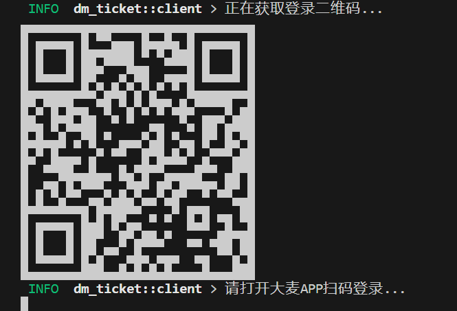
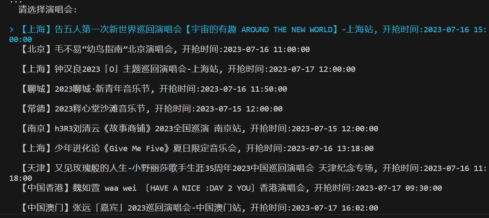
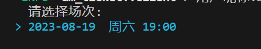
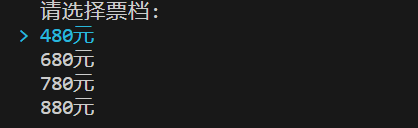
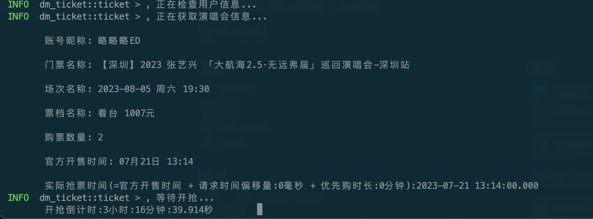

# dm-ticket

## 简介

大麦网自动购票, 支持docker一键部署。

## **此项目已失效(2023/07/31注)**

## **[进TG群的点这里](https://faka577.site/buy/5)** 

## 原理

- 扫码登录: 
  - 1. API获取二维码输出到终端, 轮询扫码状态。
  - 2. 扫码成功后, 获取cookie, 此时的cookie缺少某些字段无法使用。
  - 3. chromedriver操作浏览器带上第2步获取的cookie跳转h5用户信息页面, 得到最终的cookie。
- 抢票:
  - 1. 通过API生成订单, 提交订单。

## 特别声明

- 本项目内所有资源文件，禁止任何公众号、自媒体进行任何形式的转载、发布。
- 编写本项目主要目的为学习和研究Rust，无法保证项目内容的合法性、准确性、完整性和有效性。
- 本项目涉及的数据由使用的个人或组织自行填写，本项目不对数据内容负责，包括但不限于数据的真实性、准确性、合法性。使用本项目所造成的一切后果，与本项目的所有贡献者无关，由使用的个人或组织完全承担。
- 本项目中涉及的第三方硬件、软件等，与本项目没有任何直接或间接的关系。本项目仅对部署和使用过程进行客观描述，不代表支持使用任何第三方硬件、软件。使用任何第三方硬件、软件，所造成的一切后果由使用的个人或组织承担，与本项目无关。
- 本项目中所有内容只供学习和研究使用，不得将本项目中任何内容用于违反国家/地区/组织等的法律法规或相关规定的其他用途。
- 所有基于本项目源代码，进行的任何修改，为其他个人或组织的自发行为，与本项目没有任何直接或间接的关系，所造成的一切后果亦与本项目无关。
- 所有直接或间接使用本项目的个人和组织，应24小时内完成学习和研究，并及时删除本项目中的所有内容。如对本项目的功能有需求，应自行开发相关功能。
- 本项目保留随时对免责声明进行补充或更改的权利，直接或间接使用本项目内容的个人或组织，视为接受本项目的特别声明。

## 运行方式

### 使用docker

**请确保您已成功安装Docker/docker-compose**。

1. 下载[docker-compose.yml](https://github.com/ClassmateLin/dm-ticket/blob/main/docker-compose.yml)文件。
2. 启动服务: `docker-compose up -d`
3. 执行任务: `docker exec -it dm-ticket dm-client`
  
- 扫码登录: 
  
  

- 选择演唱会: 

  

- 选择场次:
  
  

- 选择票档

  

- 选择数量：

  

- 重试次数, 默认: 5次

- 重试间隔, 默认: 100毫秒

- 生成/提交订单间隔: 默认: 30毫秒

- 请求时间偏移量: 负数=>提前发送数据包, 正数推迟发送数据包, 默认0, 单位毫秒。

- 优先购时长: 正式抢购时间 - 优先购时间, 默认: 0, 单位分钟。

  

### 使用Rust

- [Rust官网](https://www.rust-lang.org/)
- [Rust字节镜像源](https://rsproxy.cn/)
- [Rust语言圣经](https://course.rs/about-book.html)
- [Rust中文社区](https://rustcc.cn/)
- [Rust环境安装教程](https://course.rs/first-try/installation.html)

**请确保您已成功安装Rust/Redis**

1. 下载浏览器对应版本的[chromedriver](https://chromedriver.chromium.org/downloads)(chrome浏览器地址栏输入`chrome://version/`可查看版本号!)
2. 启动chromedriver: `chromedriver --port=9515 --whitelisted-ips=`
3. 获取项目: `git clone https://github.com/ClassmateLin/dm-ticket.git`
4. 配置项目: `cd dm-ticket; cp .env.example .env;`
5. 启动server: `cargo run --bin dm-server`
6. 启动client: `cargo run --bin dm-client`

## 常见问题

- 仅支持[h5](https://m.damai.cn)可以购买的票， 不支持选座位。

- **现大部分门票已不支持h5端购买, 故不再更新。**

- 实名信息怎么选择?

  按实名信息顺序, 自动选择。 如购买2张票, 默认选择前两位实名人。

#### 其他项目
- [pxq_ticket](https://github.com/ClassmateLin/pxq_ticket): 票星球演唱会购票客户端。
- [zzdns](https://github.com/ClassmateLin/zzdns): 使用Rust构建的一款快速本地 DNS 解析器，用于提供更好的网络体验。支持Docker一键部署。
- [cfdns](https://github.com/ClassmateLin/cfdns): 一个本地DNS服务器, 用于测试 Cloudflare CDN 延迟和速度，获取最快 IP (IPv4 )。支持docker一键部署。
- [rust-scripts](https://github.com/ClassmateLin/rust-scripts): Rust写的一些小工具。
- [qzone-expoter](https://github.com/ClassmateLin/qzone-exporter): 基于tauri开发的QQ空间相册导出工具。
- [...](https://github.com/ClassmateLin?tab=repositories&q=&type=&language=&sort=)

